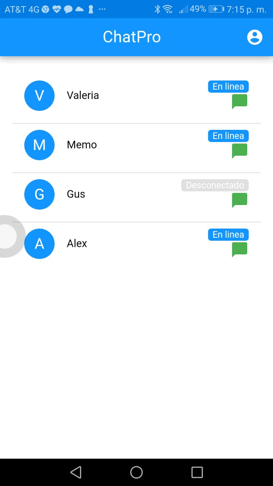

> "Las PWA's son la actual solucion para la creacion de aplicaciones multiplataforma ademas de sus sencillez y rapidez."

> Juan Pablo de Jesus Figueroa Jaramillo 2020

En esta ocasion vamos a crear una PWA con las herramientas de Quasar, cada vez este tipo de aplicaciones se hacen demasiado populares por la facilidad de desarrollar un proyecto de esa magnitud ademas de que una de sus ventajas es que es multiplataforma.

### PWA

Una Progressive Web App permite difundir contenido sobre cualquier dispositivo: móvil, tablet, desktop. Nuestra tecnología permite a tu app de adaptarse a la pantalla del usuario, creando así una experiencia única.

Todo ocurre a través de la Web. Ninguna descarga es necesaria. La restricción de pasar por las tiendas ya no existe.

Es muy fácil promover tu PWA. Solo hay que compartir su URL. Además, su presencia en los motores de búsqueda es una ventaja enorme frente a la referencia propuesta por las tiendas.

Entonces hoy vamos a ver como poder convertir nuestro proyecto en quasar en mi caso yo desarrolle un chat, y pues lo tengo como un SPA, les dire como poner los comandos necesarios para poder convertir su SPA a una PWA, como dije yo utilizare un proyecto si bien pueden utilizar mi proyecto para hacer pruebas o crear su propio proyecto, aqui les dejo la liga del repositorio del proyecto : https://github.com/JuanPablo-Hack/ChatPro

En caso de no haber utilizado mi proyecto pues solo seria crear su propio proyecto de Quasar, con el comando que todos conocemos:

```js
quasar create <nombre_del_proyecto>
```
Una vez realizado esto lo unico que vamos hacer es abrir nuestro editor de texto favorito con el proyecto que acabamos de crear, hagan modificaciones si asi lo desean en caso de que no simplemente, vamos a convertir nuestro proyecto de Quasar SPA en una PWA en un simple comando el cual sera el siguiente:

```js
quasar dev -m pwa
```
Una vez finalizado esto podemos ver que nuestra PWA ya se esta ejecutando asi que para poder verla en el celular, simplemente vamos a poner la direccion de IP de nuestro computador donde se esta ejecutando nuestro proyecto ejemplo: 192.168.0.88:8080,vamos a las opciones de Google y damos click en la opcion de agregar a la pantalla principal y listo ya tienes tu PWA a en tu celular, y aparecera algo asi:


