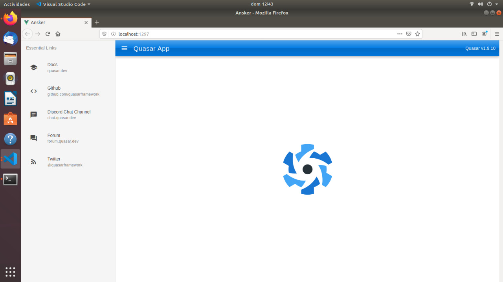

> "El futuro de las aplicaciones esta tomando mas un entorno web, lo que se esta volviendo cada vez mas sencillo y rapido de desarrollar"

> Juan Pablo Figueroa 2020

Quasar CLI es el orgullo de Quasar Framework. Puedes construir sin problemas:

- Un SPA (Aplicación de página única / Sitio web),

- Un SSR (aplicación / sitio web renderizado del lado del servidor),

- Una PWA (aplicación web progresiva),

- Una aplicación móvil (a través de Cordova),

- Una aplicación de escritorio

Dentro de la misma carpeta del proyecto, asegurando que está siguiendo las mejores prácticas de Quasar, mientras que todo simplemente funcionará de inmediato.

## Requisitos 

Para poder instalar la Interfaz de linea de Comando de Quasar tenemos que tener instalados node y npm, en mi caso yo estoy utilizando node v10.19.0 y npm 6.14.3, bueno entonces dicho esto vamos a comenzar a descargar el modulo de trabajo de Quasar con el siguiente comando:

```js
// Node.js >= 8.9.0 es requirido.

$ yarn global add @quasar/cli
// o
$ npm install -g @quasar/cli
```

Comenzara la descarga, una vez que termine dira que el framework se ha instalado de manera correcta, y podremos iniciar nuestros proyectos, el dia de hoy haremos un breve ejemplo como siempre, crearemos una SPA con los comandos basicos de Quasar, entonces vamos a la terminal e ingresamos el siguiente comando:

```js
quasar create <nombre_del_proyecto>
```

Comenzara la configuracion de su proyecto, usted puede customizar su proyecto de la manera que usted quiera, una vez ya configurado se comienza a crear el proyecto, esperamos unos breves minutos y listo nuestro proyecto hasta listo para ejecutarse, vamos de nuevo a la terminal y ejecutamos el comando:

```js
quasar dev
```

Entonces veremos que nuestra SPA se habra creado y vamos a http://localhost:8080, para verificar que fue creada con exito, como resultado no va a dar algo asi:


